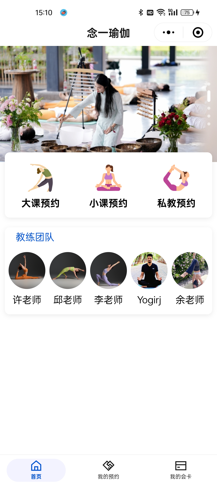
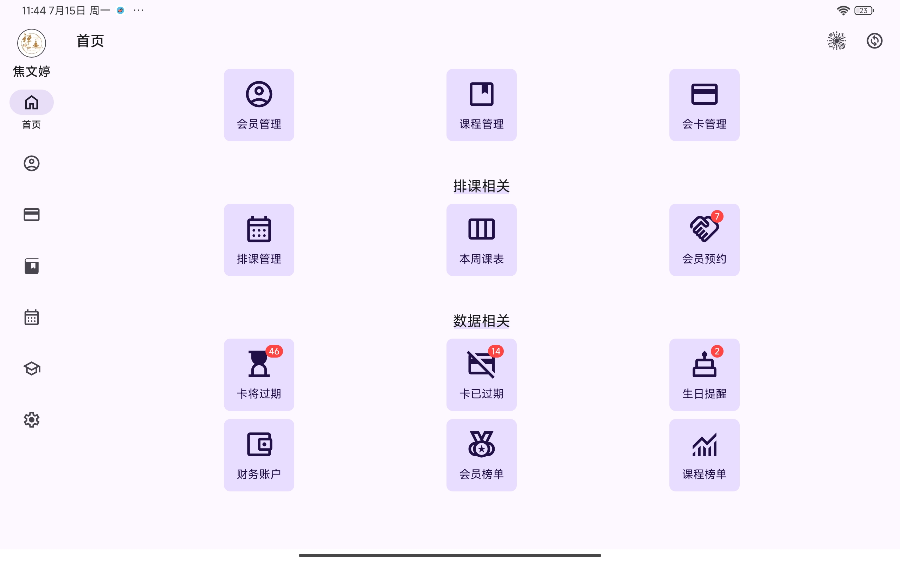
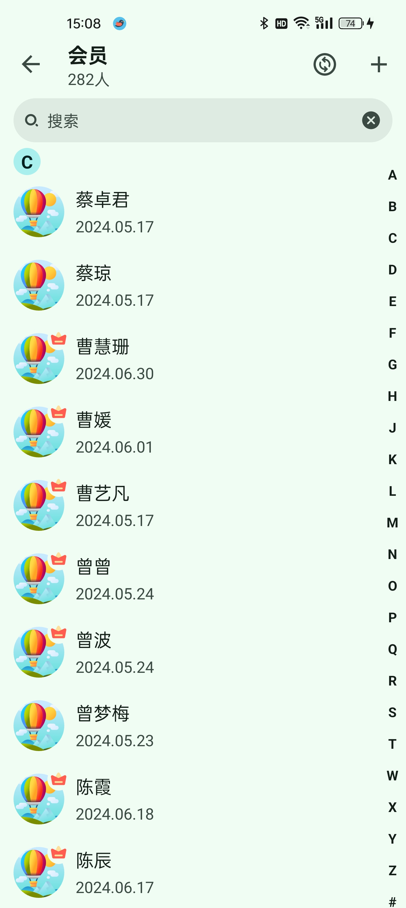
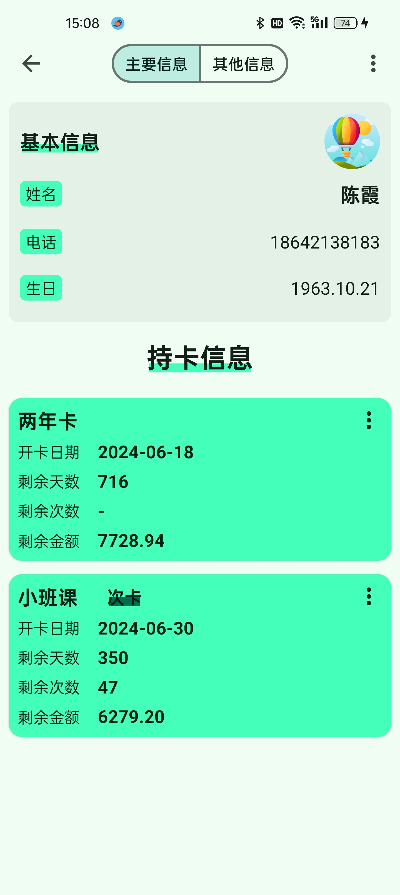
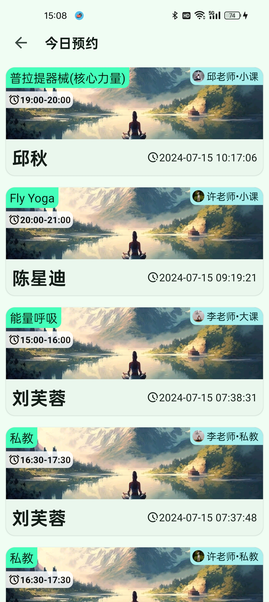

# 念一课程预约

### 介绍
念一预约是用于预约课程系统，可用于线下体育，健身等课程预约。用户端为微信小程序，可以查看预约和取消预约课程。
Pad 或者 手机端为 管理员端，可以维护场馆的课程，会员，会卡，排课等

### 技术栈
springboot，android，微信小程序(TDesign),MySQL

### 用户端功能

1.  查看排课(大课、小课、私教)
2.  预约课程
3.  取消预约
4.  会卡信息

#### 主页

#### 课程预约
![Pad端](Screenshot_2024-07-15-15-22-01-73_e39d2c7de19156b.jpg

### 管理员端

1.  会员管理
2.  课程管理
3.  排课管理
4.  会员卡管理

#### Pad端

#### 会员管理

#### 会员信息

#### 排课管理

#### 课程管理

#### 今日预约

#### 消费记录

